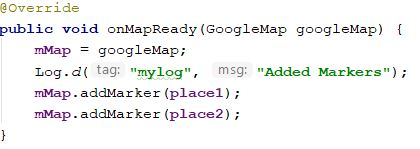
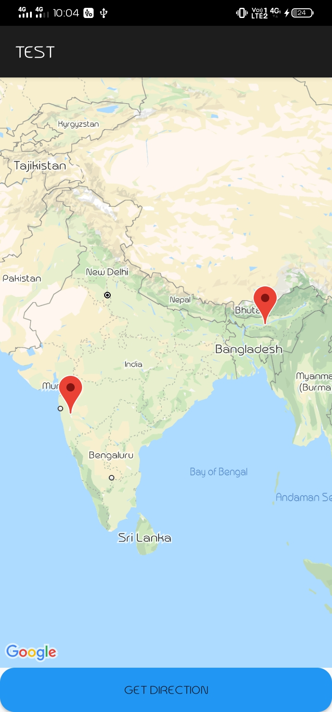

# Parsing-json-data-and-add-a-line-between-two-location-in-map-using-googleMap-and-using-firebase-for-registration

In this app parsing an array of JSON data and from that data taking the latitude and longitude drawing a line from current location

## Dependency

here we put dependencies of `Firebase` and `google services` in `build.gradle` and `build.gradle` app and project both.

## Getting Started

First we need to get the google map key and put the key value in string folder 

  

also need to put `meta-data` in `manifests`

## Codes

-parsing the array of json fron url:

-get direction from current location to mentioned location:

-latitude and longitude of place one and two:

-add marker to show the line:

## ScreenShots

        
